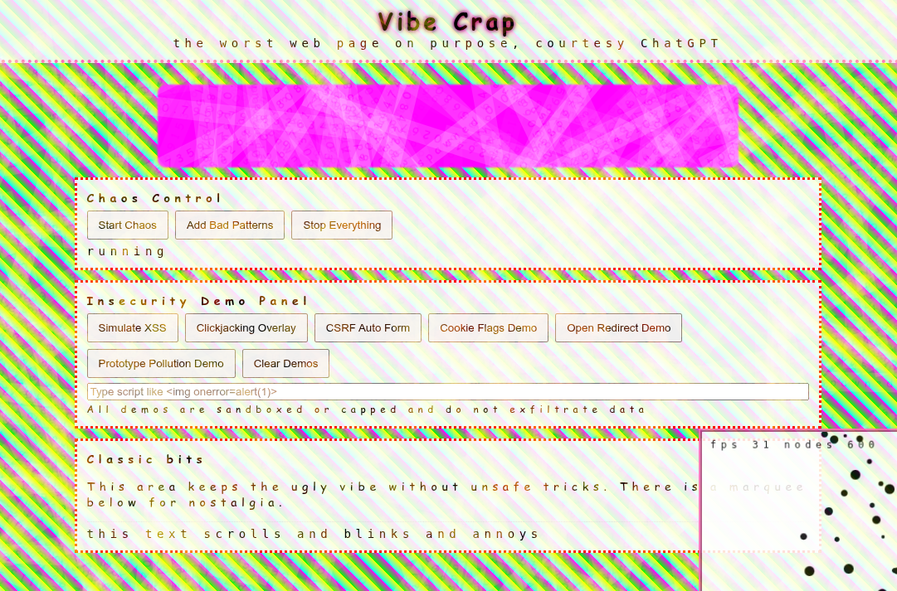

# 🎨 Vibe Crap 💩

  

Welcome to **Vibe Crap**, the worst HTML + CSS + JavaScript experiment on the web, brought to you by generative AI prompts. Hosted at [VibeCrap.com](https://vibecrap.com), this is an example of the worst crap that ChatGPT will spit out. It might be a learning exercise. It might be a warning. It might inspire you to smear vibe crap all over the web. 

This is a parody project by [Ivy Cyber](https://ivycyber.com) showing just how fast generative AI can churn out terrible, anti-pattern-filled code.

**⚠️ WARNING:** Vibe Crap can eat up your memory and freeze your browser even though there are guard rails added to mitigate against it.

**ℹ️ NOTE:** All of this is considered safer by ChatGPT than [typing "Ted Rall" into the prompt](https://rall.com/2025/04/18/ted-rall-chatgpt-unpersoning-ai-censorship-orwellian-dystopia).

In some ways this is a parody of web standard tests like the [Acid series](https://en.wikipedia.org/wiki/Acid3), but instead of compliance, it demonstrates the crap that can go wrong in web development when you're relying upon generative AI to code for you. It’s intentionally ugly, intentionally broken, and intentionally funny... but it also should make you think critically about "vibe coding" with generative AI prompt systems. Make of it what you wish — you're gonna do what you want anyway, and we're not your parents.

---

## ⚡ Features

* **Chaos Control Panel**: Buttons to start chaos, inject more bad patterns, and stop it all.
* **Awful Practices Demonstrated**:

  * Layout thrashing with forced reflows.
  * Gentle but intentional memory leaks (capped for safety).
  * Node spam up to thousands of elements.
  * Deeply nested DOM structures.
  * Overloaded event listeners.
  * Self-reacting mutation observers.
* **Canvas Visualizer**: Glitchy animation with particle spam and FPS counter.

---

## 🛡️ Insecurity Demos

The Insecurity Demo Panel shows common vulnerabilities in a safe, sandboxed way:

* **Simulated XSS** — demonstrates why `innerHTML` is unsafe.
* **Clickjacking Overlay** — invisible iframe tricking clicks.
* **CSRF Auto Form** — auto-submitting a form without user action.
* **Cookie Flags Demo** — shows weak cookies without `Secure` or `SameSite`.
* **Open Redirect** — link rewired via unvalidated `next` parameter.
* **Prototype Pollution** — naive parsing into object keys.

All demos are sandboxed and capped, they do not exfiltrate data.

---

## 🕹️ How to Use

1. Clone or download this repo.
2. Open `index.html` in any modern browser.
3. Click **Start Chaos** to begin the madness.
4. Click **Add Bad Patterns** to layer in more terrible ideas.
5. Click **Stop Everything** to regain control.

---

## 🔍 Profiling the Pain

The real purpose of Vibe Crap is to learn why bad practices feel awful.

### Chrome / Chromium / Edge

* DevTools → Performance → Record for 10–20 seconds.
* Look for huge Layout and Style blocks.
* DevTools → Memory → track retained arrays and strings.

### Firefox

* DevTools → Performance → Record.
* Inspect Reflow entries and Event spam.
* Memory tool shows growth from leaks.

### Safari

* Web Inspector → Timelines.
* Record chaos.
* See Layout thrash and allocation spikes.

---

## 🛡️ Guardrails

Steps taken to mitigate memory leaks and browser crashes:

* DOM node count capped at ~4000.
* Memory leak capped at ~30 MB.
* Mutation observers stop after ~50 loops.
* Auto-stop guard kicks in if caps are exceeded.

---

## 🎓 Educational Purpose

Vibe Crap demonstrates things that should never be done on the web, that are easily vibe coded in seconds by generative AI prompt systems. What you do with that information is up to you, but someone had to create this eventually.

* It looks terrible.
* It runs poorly.
* It teaches anti-patterns.
* It helps coders think critically.

---

## 🌐 Example Nginx Config for Vibe Crap

An `nginx-conf-example.txt` is included that makes the Vibe Crap demos possible while keeping things as secure as practical:

* Redirects all HTTP traffic to HTTPS with Let’s Encrypt TLS.
* Adds modern security headers (`X-Frame-Options`, `Referrer-Policy`, `X-XSS-Protection`, `Strict-Transport-Security`, `X-Content-Type-Options`, `Content-Security-Policy`, and `Permissions-Policy`) with the `always` flag so they apply to 204/405/etc.
* Provides a POST “sink” that safely returns `204` for the CSRF demo instead of throwing `405 Method Not Allowed`.
* Tightens CSP so forms and frames only work against `self` while still allowing inline scripts/styles for the chaos lab.

This setup lets the Vibe Crap CSRF demo work without modifying the HTML, and still scores an “A” rating at [securityheaders.com](https://securityheaders.com/).

---

## 🤝 Contributing

Want to make Vibe Crap even worse? Fork it, add your awful ideas, and submit a pull request.

* No build tools required — just plain HTML, CSS, and JavaScript.
* The uglier the better.
* Guard rails must stay in place to avoid actual crashes. We do actually care about users, whether or not your AI assistant does.

---

## 🏆 Hall of Shame

Community-contributed awful features? Maybe you could be the "vibe coder" to add: 

* Over-nested tables with inline styles
* Base64 inline background videos
* Infinite spinners made with `setInterval`

...just don't type "Ted Rall" into ChatGPT or [it will break](https://rall.com/2025/04/18/ted-rall-chatgpt-unpersoning-ai-censorship-orwellian-dystopia). 😉

---

## ⚠️ Disclaimer

Vibe Crap is for educational and entertainment purposes only. Do not deploy it in production, do not embed it on client projects, and do not take it seriously. Unless you want to learn what pain feels like in HTML, CSS, and JS. Vibe Crap can eat up your memory and freeze your browser even though there are purposeful guard rails added to mitigate against that behavior.

THE SOFTWARE IS PROVIDED "AS IS", WITHOUT WARRANTY OF ANY KIND, EXPRESS OR IMPLIED, INCLUDING BUT NOT LIMITED TO THE WARRANTIES OF MERCHANTABILITY, FITNESS FOR A PARTICULAR PURPOSE AND NONINFRINGEMENT. IN NO EVENT SHALL THE AUTHORS OR COPYRIGHT HOLDERS BE LIABLE FOR ANY CLAIM, DAMAGES OR OTHER LIABILITY, WHETHER IN AN ACTION OF CONTRACT, TORT OR OTHERWISE, ARISING FROM, OUT OF OR IN CONNECTION WITH THE SOFTWARE OR THE USE OR OTHER DEALINGS IN THE SOFTWARE.

---

© 2025—present [Ivy Cyber](https://ivycyber.com). Released under [CC0 1.0 Universal (Public Domain Dedication)](https://creativecommons.org/publicdomain/zero/1.0/).
